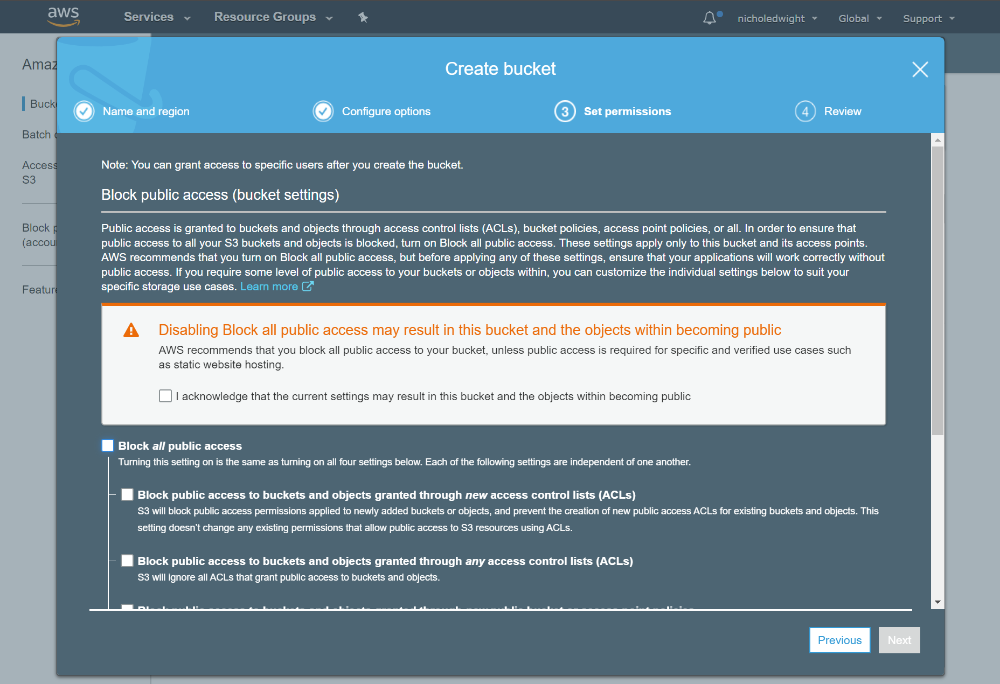
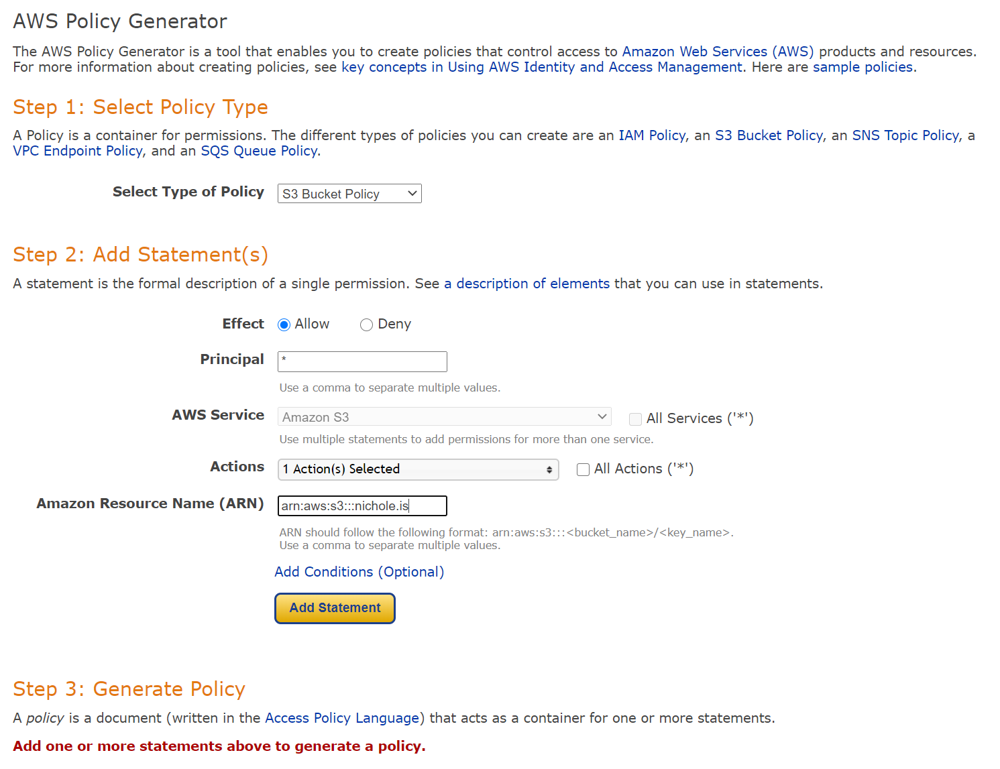
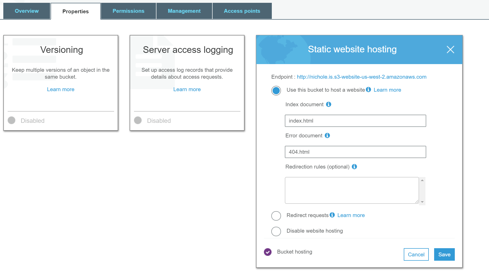

**This post assumes you have already registered your domain with Route53 or you have configured your DNS to allow Route53 control over your domain.**

## 1. Setting up Amazon Simple Storage Service (S3)

Using S3 to host your website is a great idea, simply because it's so darn simple. It's only a viable option with a static website that doesn't require any server-side technologies.

The first step you're going to take is to **create a bucket**. Click the Services dropdown, and search for S3. Your bucket name **must be unique** because the name is shared globally. If you have already registered your domain, it's a great idea to just name your bucket with your domain name! Select your region as well, I tend to choose the region that's geographically closest to me. Click **next** until you get to the **permissions** section, `uncheck Block all public access`, this is to ensure visitors to your website can actually access it.

Once your bucket has been created, click on the row - a menu should slide in from the right. Click the **copy ARN** button. 

Then enter the bucket by clicking the name text in back in the row. We're going to setup a bucket policy now, so click the **permissions** tab -> **bucket policy**. You should see an empty editor. Near the bottom click the **generate policy** button, this will open a new tab. Go ahead and copy over these selections:

`Select Type of Policy - S3 Bucket Policy`

`Effect - Allow`

`Principal - *`

`AWS Service - Amazon S3`

`Actions - GetObject`

`Amazon Resource Name (ARN) - paste in the ARN we copied from the previous page` **PLUS** `/*` - it's important to append this to your bucket ARN so all the contents inside have the same access!
Click **Add statement** and then **Generate Policy** at the bottom, it will return your policy in JSON, similar to my result below. Copy this and paste it into that empty Permissions -> Bucket Policy editor.

<svg xmlns="http://www.w3.org/2000/svg" width="54" height="14" viewBox="0 0 54 14"><g fill="none" fill-rule="evenodd" transform="translate(1 1)"><circle cx="6" cy="6" r="6" fill="#FF5F56" stroke="#E0443E" strokeWidth=".5"></circle><circle cx="26" cy="6" r="6" fill="#FFBD2E" stroke="#DEA123" strokeWidth=".5"></circle><circle cx="46" cy="6" r="6" fill="#27C93F" stroke="#1AAB29" strokeWidth=".5"></circle></g></svg>

<pre class="result">
{
  "Id": "Policy1598202680478",
  "Version": "2012-10-17",
  "Statement": [
    {
      "Sid": "Stmt1598202677883",
      "Action": [
        "s3:GetObject"
      ],
      "Effect": "Allow",
      "Resource": "arn:aws:s3:::nichole.is/*",
      "Principal": "*"
    }
  ]
}
</pre>

Open up your bucket properties one more time, click on **Static website hosting** and make sure this is enabled. Your index document should be `index.html` and your Error document `404.html` if you haven't created alternatives.

### We're almost there!!

Now we need to go back to the **Overview** tab of your bucket, this is where we're going to upload our content using the **AWS CLI**.

Before we can upload anything, we need to ensure your project has a production ready build! First, run `gatsby build`, then check your site is working as expected by running `gatsby serve` to see a local version of your production-ready site.

## 2. Installing and using AWS CLI

Open up your terminal and install the AWS CLI via `pip3 install awscli`, you may need to use `sudo` here to install as root.

Once installed, you'll need to run `aws configure` to get it setup and connected to your AWS account. You'll need your AWS access key ID as well as the secret key tied to it. If you've lost your csv containing this information, you can just create a new access key for your user. Head over to **IAM** -> users -> select your user -> **security credentials** -> **Create access key**

<svg xmlns="http://www.w3.org/2000/svg" width="54" height="14" viewBox="0 0 54 14"><g fill="none" fill-rule="evenodd" transform="translate(1 1)"><circle cx="6" cy="6" r="6" fill="#FF5F56" stroke="#E0443E" strokeWidth=".5"></circle><circle cx="26" cy="6" r="6" fill="#FFBD2E" stroke="#DEA123" strokeWidth=".5"></circle><circle cx="46" cy="6" r="6" fill="#27C93F" stroke="#1AAB29" strokeWidth=".5"></circle></g></svg>

> aws configure
<pre class="result">
    AWS Access Key ID [None]: Your Access Key
    AWS Secret Access Key [None]: Your Secret Key
    Default region name [None]: Your chosen region
    Default output format [None:] Your Output Format (I chose JSON)
</pre>
>

**Before you execute this next command!** please note that you're uploading a Gatsby project, we don't want to include files such as your node_modules and .git files! So we'll only point directly to your public folder. You could go about this in a few other ways if you want to upload various other files, you could use `--include` or even `--exclude=.git`. If you're wondering what I was, yes you can use multiple `--exclude` arguments.

You'll also want to make use of the `--acl` option, this stands for access control list. By using `--acl public`, you'll automatically set all files being uploaded to public, this way visitors to your site will be able to access your content.

Now it's time to upload the files, you'll want to execute the following command:

<svg xmlns="http://www.w3.org/2000/svg" width="54" height="14" viewBox="0 0 54 14"><g fill="none" fill-rule="evenodd" transform="translate(1 1)"><circle cx="6" cy="6" r="6" fill="#FF5F56" stroke="#E0443E" strokeWidth=".5"></circle><circle cx="26" cy="6" r="6" fill="#FFBD2E" stroke="#DEA123" strokeWidth=".5"></circle><circle cx="46" cy="6" r="6" fill="#27C93F" stroke="#1AAB29" strokeWidth=".5"></circle></g></svg>

<pre class="result">
aws s3 sync {YOUR-LOCAL-PATH-TO-FOLDER} s3://{{YOUR-BUCKET-NAME} --acl public-read
</pre>

Depending on your system, you may need to wrap your local path in quotes. In my instance this command looked like `aws s3 sync ~/projects/gatsby-blog/public s3://mybucketname --acl public-read`.

## 3. DNS

Let's head back over to Route53, select your hosted zone, we're going to create a type A record for your domain. A type A record is used to route traffic to a resource, such as a web server, or your S3 bucket!

Click **Create Record**, select the defaulted option, simple routing. Click **Define simple record**. You can leave your record name blank, select "Alias to S3 website endpoint" for your endpoint, select the region you chose earlier when creating your S3 bucket, and finally select your S3 bucket's name. Then hit **Define simple record** to create and add the record to your domain.

Now, you may need to give it some time to propagate, but your site should be live! If it's still processing everything, you can go back to your S3 bucket -> Properties -> Static Website hosting -> click the bucket url to view your site's contents.

## 4. ✨