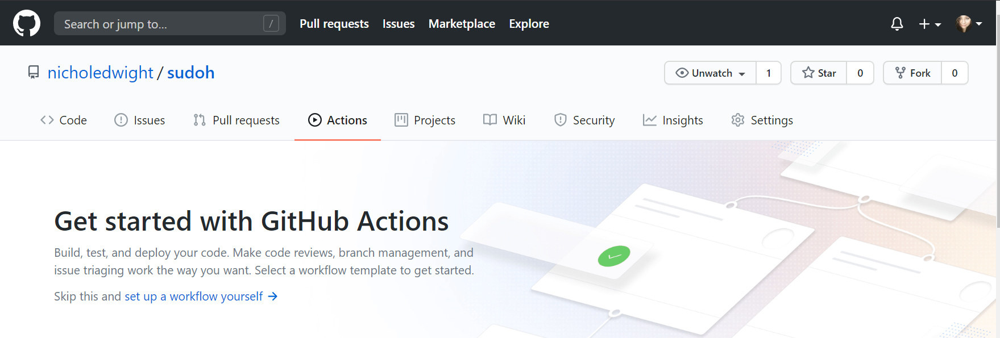
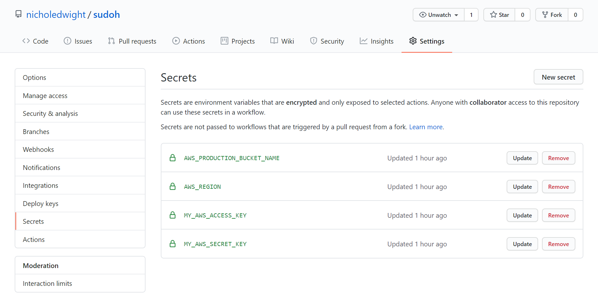
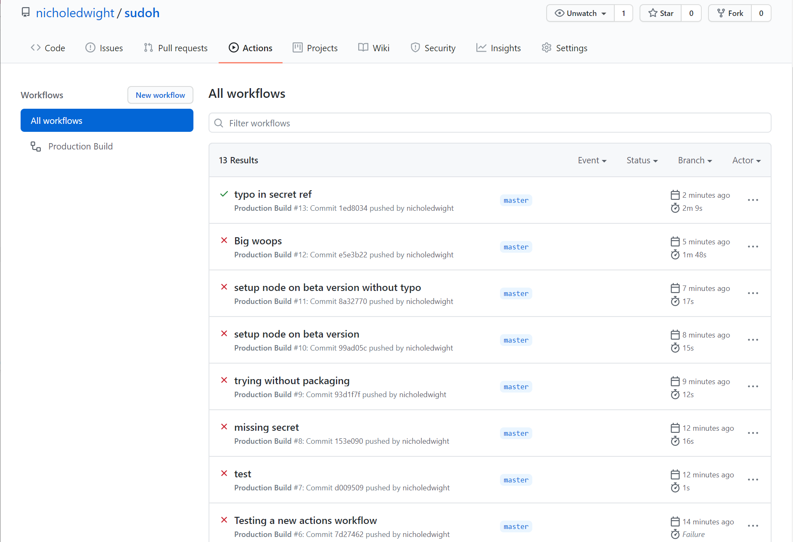

In the previous post, we had a look at how to deploy our Gatsby static website to an AWS S3 bucket, in this post we'll learn how to automate that deployment on push using Github Actions.

Github Actions is a feature that allows you to use serverless resources to build binaries, automate tests, execute deployments, or even just run Linux commands without having to use servers.

**From here on out, I'm assuming you know how and have pushed your project to a repository on Github.**

There are two ways to get started with Github Actions, my preferred way is through the **Actions** tab on my repository on Github, the second way is adding the workflow file directly to the repo itself.

You should also see a **Get Started** button on this page if you have not previously setup Github Actions in your repo. Go ahead and skip this and instead we're going to be *set up a workflow yourself*

You should now see an example template for your YAML workflow file in the editor. You can rename the file to *production.yml* if you'd like or just leave it as is. If you'll be deploying staging or dev environments, it's a good idea to rename your YAML files appropriately. Click **Start commit** and go back to your project tp *pull* the latest change. This workflow file will live in `./github/workflows/`

Go back to your code, open your new workflow file and change the `name` to *Production Build* and `on` key to trigger on push to your master branch.

<svg xmlns="http://www.w3.org/2000/svg" width="54" height="14" viewBox="0 0 54 14"><g fill="none" fill-rule="evenodd" transform="translate(1 1)"><circle cx="6" cy="6" r="6" fill="#FF5F56" stroke="#E0443E" stroke-width=".5"></circle><circle cx="26" cy="6" r="6" fill="#FFBD2E" stroke="#DEA123" stroke-width=".5"></circle><circle cx="46" cy="6" r="6" fill="#27C93F" stroke="#1AAB29" stroke-width=".5"></circle></g></svg>

<pre class="result">
name: Production Build

on:
  push:
    branches: 
      - master
</pre>

This will trigger the workflow file and the steps you define below whenever you push to your master branch, or whichever branch you specified. The next step is to define `jobs`, this is where we add the functions that will run after the push. As you can see below, the `runs-on` has the value of `ubuntu-latest`, this outlines the virtual instance we will be running our site on. 

<svg xmlns="http://www.w3.org/2000/svg" width="54" height="14" viewBox="0 0 54 14"><g fill="none" fill-rule="evenodd" transform="translate(1 1)"><circle cx="6" cy="6" r="6" fill="#FF5F56" stroke="#E0443E" stroke-width=".5"></circle><circle cx="26" cy="6" r="6" fill="#FFBD2E" stroke="#DEA123" stroke-width=".5"></circle><circle cx="46" cy="6" r="6" fill="#27C93F" stroke="#1AAB29" stroke-width=".5"></circle></g></svg>

<pre class="result">
name: Production Build

on:
  push:
    branches: 
      - master

jobs:
  build:
    runs-on: ubuntu-latest

</pre>

Next we'll define the `steps`, this is where we outline what the workflow will actually do. First is `actions/checkout@v2`, this action checks-out your repo, by default it's the repo that triggered this action that is checked out. Next we use `actions/setup-node@v1`, this will setup our virtual Node environment using our specified version - I'm using 14 in this example but feel free to use whichever version you used to build your project. The rest of the steps are pretty simple and self-explanatory, we install npm and then build our app, configure our AWS credentials, and deploy! But wait! **AWS credentials?! Where and what are those!** 

<svg xmlns="http://www.w3.org/2000/svg" width="54" height="14" viewBox="0 0 54 14"><g fill="none" fill-rule="evenodd" transform="translate(1 1)"><circle cx="6" cy="6" r="6" fill="#FF5F56" stroke="#E0443E" stroke-width=".5"></circle><circle cx="26" cy="6" r="6" fill="#FFBD2E" stroke="#DEA123" stroke-width=".5"></circle><circle cx="46" cy="6" r="6" fill="#27C93F" stroke="#1AAB29" stroke-width=".5"></circle></g></svg>

<pre class="result">
name: Production Build

on:
  push:
    branches: 
      - master

jobs:
  build:
    runs-on: ubuntu-latest

    strategy:
      matrix:
        node-version: [8.x, 10.x, 12.x, 14.x]

    steps:
      - name: Git clone our repo
        uses: actions/checkout@v2

      - name: Use Node.js 14
        uses: actions/setup-node@v1
        with:
          node-version: "14"

      - name: NPM Install
        run: npm install

      - name: Gatsby Build
        run: npm run build

      - name: Configure AWS Credentials
        uses: aws-actions/configure-aws-credentials@v1
        with:
          aws-access-key-id: ${{ secrets.MY_AWS_ACCESS_KEY }}
          aws-secret-access-key: ${{ secrets.MY_AWS_SECRET_KEY }}
          aws-region: ${{ secrets.AWS_REGION }}

      - name: Deploy to S3
        run: aws s3 sync ./public s3://${{ secrets.AWS_PRODUCTION_BUCKET_NAME}} --acl public-read

</pre>

Don't you worry! Let's take a moment to head back to your Github repo, under **settings** -> **secrets**, you'll see a button to add *New secret* to your repo. 

Go ahead and make one for `MY_AWS_ACCESS_KEY` which should be the access key you previously generated when setting up your IAM user in the last post. If you've lost this information and didn't download the .csv file containing it all, generate a new access key - be sure to download the .csv for this one! Once you've secured your information, go back to Github and create a few more secrets, `MY_AWS_SECRET_KEY`, `AWS_PRODUCTION_BUCKET_NAME`, and `AWS_REGION`

Now that those are defined, your script will be able to reference that information *without* exposing your confidential credentials to the rest of the intertubes! ✨ You should also notice that under the *deploy* step, we've added the argument `--acl public-read`, you'll recognize this if you followed my last post on AWS deployment. This is to ensure all the content you upload to your S3 bucket is accessible to the visitors of your site, we used it alongside the AWS CLI command `aws s3 sync` before.

You should now be able to push your complete workflow file back up to your branch that triggers your workflow and watch the magic happen from the Actions tab! Woop, woop!

Hopefully you won't be like me and have a lot of errors along the way, various things like typos in version references, variables, etc. There are multiple ways to go about deploying to AWS S3 via Github Actions, this is just one example.